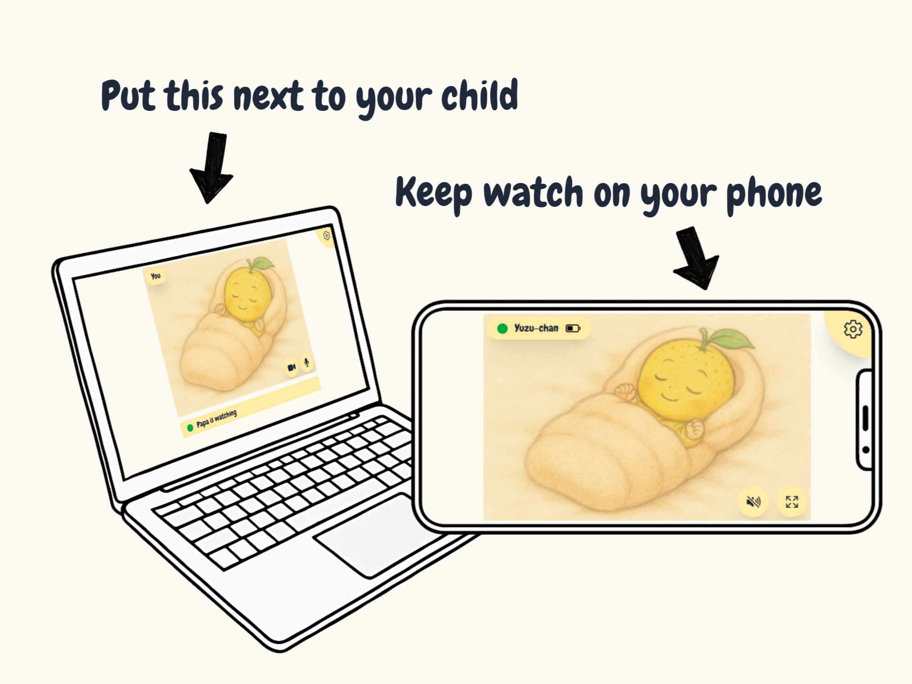

# Yuzukam

A privacy-first, self-hosted baby monitor for your local network.

<p align="center">

</p>

## About

Yuzukam is a baby monitoring web-app meant to be self hosted in your local network - no data
stored, no cloud-connection, no subscriptions. Designed for privacy-minded parents that host their
own stuff.

## Setup

To use Yuzukam in your local network, some setup is required:
Browsers block webcam and microphone access on non-secure pages.
You’ll need to either enable HTTPS in your network or use a Chromium-based browser with a security
exception.

The following steps walk you through the easiest option of using a Chrome-based browser with an
insecure origin override.

### 1. Host the app

Run Yuzukam on your home server (or any other always-on device in your LAN) using Docker Compose:

```yml
services:
  yuzukam:
    image: ghcr.io/janlucaklees/yuzukam:latest
    restart: unless-stopped
    ports:
      - '3000:3000'
```

### 2. Prepare your camera device

Choose a device to place near your baby - usually an old laptop or something with a webcam and
microphone.

1. Install a Chromium-based browser (like Chrome, Brave, or Edge).

2. In that browser, visit [chrome://flags/#unsafely-treat-insecure-origin-as-secure](chrome://flags/#unsafely-treat-insecure-origin-as-secure)

3. Add your host device’s address, using this format: `http://<host>:<port>`

> ⚠️ This only works on desktop Chromium browsers. Mobile or Safari / Firefox users will need
> HTTPS.

### 3. Start monitoring your baby

Open Yuzukam in the browser on your camera device. Position it so the webcam faces your baby.

> ⚙️ Click the gear icon in the top right to give the device a name (e.g. “nursery” or your babys
> name).

Then, from any other device in your home network, open the same Yuzukam address to monitor the stream.

> 🖥️ On first launch, each device is set to “Camera” mode. To switch a device to “Monitor” mode,
> click the gear icon in the top right, then tap the camera icon. This setting is saved on device and
> only needs to be changed once.

## Features

- Support watching mutiple babys from multiple devices simultaneously
- Lets you name devices for clarity (e.g. "nursery", "living room", or your childs name)
- Runs in any modern browser, on Linux, Windows and probably Mac!
- Gives new life to old devices

## Privacy

- ❌ No internet streaming (local network only)
- ❌ No recording or cloud storage
- ❌ No phoning home, no analytics, no tracking
- ❌ No account needed, no subscriptions

---

## License

The source code for this project is licensed under the Mozilla Public License 2.0.
For details on third-party licensing, Docker image usage, bundled libraries, and UI asset rights,
please refer to the [NOTICE.md](./NOTICE.md) file.

---

**Yuzukam** is a self-hosted, local-only baby monitor built for privacy-conscious parents and DIY home server setups. It runs entirely offline and is ideal for repurposing old devices as secure, cloud-free baby cams.
